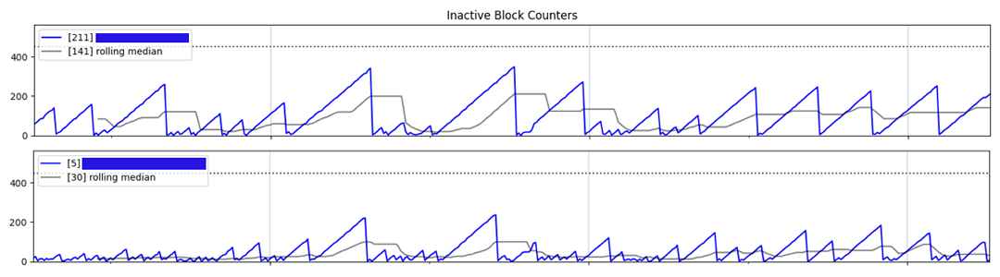

# Helium Heartbeat

## A Quick Overview

This script collects data for every hotspot in a given wallet, comparing the Helium Blockchain Height to the most recent activity block of each hotspot over time. This data is plotted and sent to the user via the [Pushover][pushover-link] API on a `Timely` and `Alert` basis.

[pushover-link]: https://pushover.net/

## Blog Post

You can find a more detailed walk through on my thinking and implementation on [my blog][blog-post-link]

[blog-post-link]: https://gutentag.co/34pMf90

## Setup

### virtualenv

This code was written with Python3.9, though I suspect it will work well with Python3.7+ (it uses `f-strings` quite a bit)

---

## What is Helium?

[Glad you asked.][what-is-helium-video]

Helium is a global, distributed network of Hotspots that create public, long-range wireless coverage for Internet of Things (IoT) devices.

It is pretty, dang, cool.

The Helium relies on Hosts, people like you and me to provide this long-range wireless coverage by installing Helium Hotspots in our homes, offices or whereever we (with permission!) can!

How the network works is a whole other blog post, but for quick reference, checkout the [FAQ on the Helium website][helium-faq].

[what-is-helium-video]: https://gutentag.co/3CtTbyp
