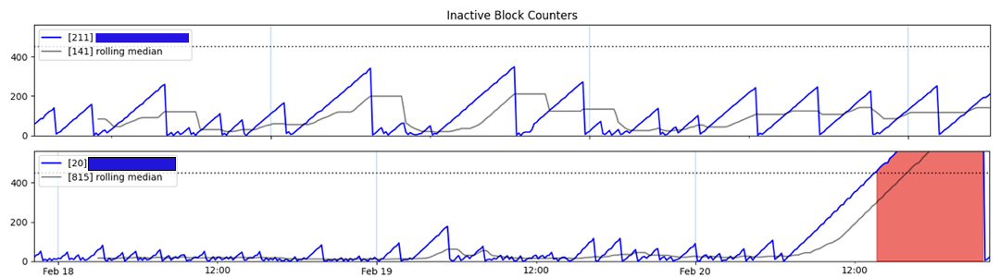

# Helium Heartbeat



## Overview

This script collects data for every hotspot in a given wallet, comparing the Helium Blockchain Height to the most recent activity block of each hotspot over time. This data is plotted and sent to the user via the [Pushover][pushover-link] API on a `Report` and `Alert` basis.

To anyone hoping to use this script to monitor your own hotspots please clone or fork this repo! If you see mistakes or have suggestions please submit pull requests!

[pushover-link]: https://pushover.net/

## Known Limitations

- This script will be slow if you have dozens of hotspots, multithreading helps, but the Helium API is only so fast.
- This whole system is designed to run with just a single wallet address at a time, passing a different `WALLET_ADDR` from run to run will throw all the data into one giant bucket.

## Setup

You can find a more detailed walk through on the implementation on [my blog][blog-post-link] but here are the basics

[blog-post-link]: https://gutentag.co/3MzZNAb

### Create A virtualenv

This code was written with Python3.9, though I suspect it will work well with Python3.6+ (it uses `f-strings` quite a bit)

Create a virtual environment and install the `requirements` using

```bash
pip install -r requirements.txt
```

### Store Your Wallet Address In Environment Variables

I do this in `/postactivate` and `/predeactivate`

Edit the `/postactvate` file:

```bash
#!/bin/zsh
# This hook is sourced after this virtualenv is activated.

export WALLET_ADDR="a-valid-wallet-address"
```

Edit the `/predeactivate` file:

```bash
#!/bin/zsh
# This hook is sourced before this virtualenv is deactivated.

unset WALLET_ADDR
```

### Pushover API Keys

Two [Pushover][pushover-link] Apps are recommended, at least one is necessary.

|        App Name         |      Environment Variable       |                           Description                            |
| :---------------------: | :-----------------------------: | :--------------------------------------------------------------: |
| **Pushover Report Key** | `PUSHOVER_APP_TOKEN_HNT_REPORT` |     regular updates, when all hotspots are considered active     |
| **Pushover Alert Key**  | `PUSHOVER_APP_TOKEN_HNT_ALERT`  | when a hotspot "active" status has changed to inactive or active |

Add these to teh `/postactivate` and `/predeactivate` files

---
